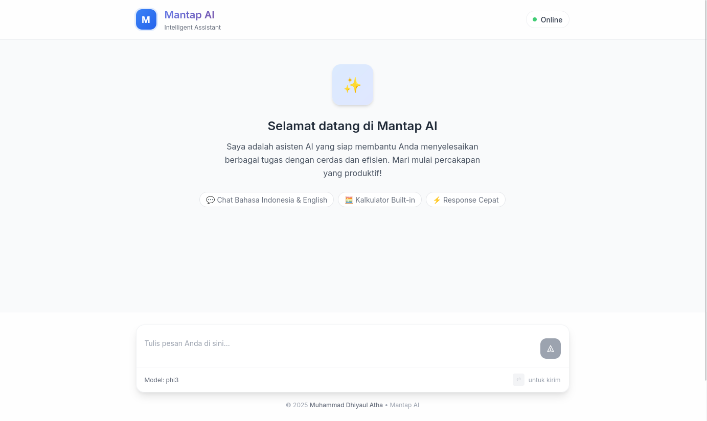

# ✨ Mantap AI  

Backend + WebUI sederhana untuk menjalankan AI Assistant menggunakan [Ollama](https://ollama.ai) dan [FastAPI](https://fastapi.tiangolo.com).  
UI didesain modern & responsif menggunakan **TailwindCSS**.  

---

## 🚀 Fitur
- 🔗 Integrasi dengan **Ollama API** (local LLM seperti Llama2, Mistral, dll).
- 💬 Chat API (`/chat`) + Streaming API (`/chat-stream`).
- 🖥️ WebUI cantik berbasis **HTML + TailwindCSS**.
- 🌐 CORS sudah diaktifkan (siap untuk frontend custom).

---

## 📂 Struktur Project
<pre>
mantap-ai/
│── main.py # FastAPI backend
│── templates/
│ └── index.html # UI Chat (Frontend)
│── static/ # file CSS/JS tambahan
│── README.md
</pre>

---

## 🛠️ Instalasi

1. **Clone repo**
   ```bash
   git clone https://github.com/Bangkah/mantap-ai.git
   cd mantap-ai

2. **Buat virtual environment (opsional)**
    ```bash 
    python -m venv venv
    source venv/bin/activate   # Linux/Mac
    venv\Scripts\activate      # Windows

3. **Install dependencies**
    ```bash
    pip install -r requirements.txt

4. **Kalau requirements.txt belum ada, minimal install:**
    ```bash
    pip install fastapi uvicorn requests jinja2

5. **Pastikan Ollama sudah jalan**
    ```bash
    ollama serve

6. **Jalankan server**
    ```bash
    uvicorn main:app --reload --host 0.0.0.0 --port 8000

## 🌐 API Endpoints

    GET / → Halaman UI (chat interface).

    GET /health → Cek status backend & koneksi Ollama.

    GET /models → List model yang tersedia di Ollama.

    POST /chat → Kirim prompt & dapatkan jawaban.

    POST /chat-stream → Chat dengan response streaming.

## 🎨 Tampilan UI

UI dibuat minimalis, modern, dan responsif:

    Chat bubble dengan warna berbeda (user vs bot).

    Animasi loading ... saat menunggu jawaban AI.

    Gradient background & rounded card style.

## 📸 Screenshot

    

## 🤝 Kontribusi

Pull request & issue sangat diterima!
Feel free untuk kembangkan fitur seperti:

    🔥 Dark mode toggle

    📜 History chat

    📁 Export chat ke file

